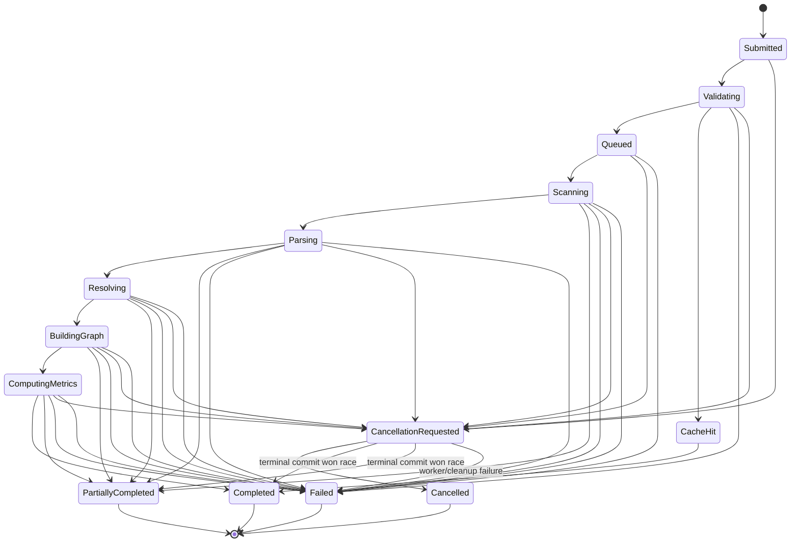

# CodeStruct versioned API contract

## Scope and conventions

This is the target local HTTP API. It is not implemented in Phase 5. Graph record
semantics are normative in [graph-schema.md](graph-schema.md), security controls
in [security-model.md](security-model.md), and legacy migration in
[migration-plan.md](migration-plan.md).

Base path is `/api/v1`. JSON uses UTF-8, snake_case, RFC 3339 UTC timestamps,
opaque IDs/cursors, and `application/json`. Request bodies reject unknown fields
by default. Responses include `api_version: "v1"`, `request_id`, and the resource
or error. Pydantic validates both requests and responses. A configured maximum
body size, query complexity, page size, and response size applies before work.

## `GET /api/v1/projects`

Phase 13 implements safe configured-project discovery. The response contains
`projects: [{id, display_name, description, available}]` plus `api_version` and
`request_id`. IDs are configured capabilities; canonical roots are never
serialized. Ordering is deterministic. The normal frontend selects an available
ID and submits `relative_path: "."`; the relative field remains temporarily
compatible for approved API subpaths. Unknown IDs are rejected and never treated
as filesystem paths.

## Shared schemas

### Project selection and analysis options

```json
{
  "project": {"root_id": "workspace", "relative_path": "my-project"},
  "options": {
    "source_grammar": "3.12",
    "include_patterns": ["**/*.py"],
    "exclude_patterns": [],
    "metrics": true
  },
  "refresh": false,
  "idempotency_key": "client-generated opaque value"
}
```

`root_id` names a server-configured authorized root; clients do not submit an
absolute path. `relative_path` is normalized and resolved beneath that root.
Options may narrow scope but cannot weaken enforced exclusions or limits. Pattern
count/length/grammar are bounded. `idempotency_key` is optional, limited in size,
scoped to the local user and endpoint, and retained for a configured window.

### Job resource

```json
{
  "analysis_id": "019...",
  "state": "parsing",
  "terminal": false,
  "progress": {
    "phase": "parsing",
    "completed": 120,
    "total": 300,
    "unit": "files",
    "percent": 40,
    "message_code": "PARSING_FILES",
    "updated_at": "2026-09-12T12:00:00Z"
  },
  "result": null,
  "diagnostics_summary": {"info": 0, "warning": 1, "error": 0},
  "links": {"self": "/api/v1/analyses/019...", "graph": null,
            "diagnostics": "/api/v1/analyses/019.../diagnostics"}
}
```

`percent` is null when total is unknown. Terminal state is exactly one of
`completed`, `partially_completed`, `failed`, or `cancelled`; `cache_hit` is a
visible nonterminal provenance state followed atomically by `completed` for the
MVP because partial results are not reusable cache entries. A terminal `result` contains `result_id`, `graph_id`,
`schema_version`, `partial`, cache metadata, and summary links when usable.

### Error envelope

```json
{
  "api_version": "v1",
  "request_id": "opaque",
  "error": {
    "code": "PROJECT_UNAUTHORIZED",
    "message": "The selected project is outside authorized locations.",
    "recoverable": true,
    "field_errors": [],
    "safe_context": {"root_id": "workspace"},
    "retry_after_seconds": null
  }
}
```

Codes and status meanings are stable within v1. No envelope contains protected
canonical paths, source, secrets, stack traces, SQL, environment values, or raw
exceptions. Common codes include `REQUEST_INVALID`, `PROJECT_NOT_FOUND`,
`PROJECT_UNAUTHORIZED`, `PATH_LINK_REJECTED`, `POLICY_LIMIT`, `JOB_NOT_FOUND`,
`JOB_TERMINAL`, `CURSOR_INVALID`, `RESULT_EXPIRED`, `RATE_LIMITED`,
`SCHEMA_UNSUPPORTED`, `STORAGE_UNAVAILABLE`, and `INTERNAL_ERROR`.

## `POST /api/v1/analyses`

Creates an analysis attempt or returns an authorized compatible cache hit.

- **Request:** `CreateAnalysisRequest` shown above.
- **Success:** `202 Accepted` with a submitted/validating/queued `JobResource`;
  `200 OK` with cache-hit provenance and a usable terminal result when a compatible
  entry is selected. `Location` identifies the job in both cases.
- **Other statuses:** `400` malformed/unsupported options, `403` unauthorized
  root/path or forbidden override, `404` configured root or selected directory
  absent, `409` idempotency key reused with different input, `413` request/scope
  estimate exceeds a preflight limit, `422` Pydantic semantic validation, `429`
  queue/concurrency rate limit, `503` executor/storage unavailable.
- **Idempotency:** the same key plus byte-equivalent normalized request returns the
  same attempt during its window. Without a key, identical requests may join a
  currently active compatible job or create a new attempt; the response says
  `duplicate_disposition: joined|new|cache_hit`. `refresh=true` bypasses reusable
  results but may join an identical active forced-refresh request.
- **Authorization/policy:** validate root ID, canonical containment, selected
  directory type, and link policy before enumerating children or revealing cache.
  Revalidate in the worker before scan. Authorization is never cached as proof.
- **Job behavior:** acceptance does not promise completion. The persisted job is
  visible before dispatch. A launch failure transitions it to `failed`.
- **Pagination/filtering:** not applicable; scope options are bounded analysis
  inputs, not result filters.
- **Compatibility/deprecation:** fields follow additive v1 rules; replacement of
  creation semantics requires a new API major and announced overlap.

## `GET /api/v1/analyses/{analysis_id}`

Returns lifecycle and result availability.

- **Request:** path ID; optional `wait_seconds` from `0` to a small configured
  long-poll maximum and optional `after_revision` integer. Ordinary clients use
  bounded polling with backoff; no streaming guarantee in MVP.
- **Success:** `200 OK` `JobResource`; with `after_revision`, it may wait until a
  newer revision or return unchanged at timeout.
- **Other statuses:** `400` invalid wait/revision, `403` caller not authorized for
  the attempt, `404` absent/expired job, `429` polling limit, `503` repository
  unavailable.
- **Idempotency:** safe and read-only. ETag is the job revision; `If-None-Match`
  may return `304`.
- **Authorization/policy:** local-user ownership and current authorized-root
  policy are checked before returning project/cache metadata.
- **Job behavior:** states are monotonic except the specified state machine; a
  new retry has a new ID. Terminal meaning never changes.
- **Pagination/filtering:** no collection pagination; revision/long-poll controls
  only suppress unchanged status responses.
- **Compatibility/deprecation:** new progress fields/states are additive; changing
  terminal meanings or state transitions requires a new API major.

## `GET /api/v1/analyses/{analysis_id}/graph`

Phase 10 implements the additive `limit`, `cursor`, `node_kind`, `edge_kind`, and
`resolution_status` subset. An unfiltered result at or below the configured byte
limit retains the original complete response. Oversized unpaged requests return
`413 GRAPH_TOO_LARGE`; bounded responses add `page` with returned/total node and
edge counts, `partial_load`, and a deterministic result/filter-bound cursor.
Endpoint-context nodes are included so every returned resolved edge remains
inspectable. The broader neighborhood/package-summary query design remains deferred.

Returns an immutable graph page, neighborhood, or aggregation slice only after a
usable terminal outcome.

- **Request parameters:** `cursor?`, `limit?`, repeated `node_kind?`, `edge_kind?`,
  `resolution_status?`, `confidence?`, bounded `q?`, `root_id?`, `depth?`, and
  `slice_mode=full_page|neighborhood|package_summary`. Mutually incompatible
  combinations are rejected. Defaults and maxima are server policy.
- **Success:** `200 OK` `AnalysisGraph` from [graph-schema.md](graph-schema.md),
  including schema/analysis metadata, full and returned counts, page cursor,
  partial indicators, nodes, edges, and referenced evidence.
- **Other statuses:** `400` invalid filter/slice/cursor, `403` unauthorized result,
  `404` job/result absent, `409` job not terminal or terminal without usable
  result, `410` result expired, `413` requested slice exceeds policy, `422`
  incompatible query combination, `503` storage unavailable.
- **Idempotency:** safe; the same immutable graph ID/query/cursor returns the same
  semantic page and ETag. Ordering is deterministic.
- **Authorization/policy:** recheck result ownership/root authorization; enforce
  query time, row, depth, and response-byte limits. Never return absolute paths.
- **Job behavior:** available for `completed` and `partially_completed`, including
  completed cache-hit results; not for failed/cancelled.
- **Pagination/filtering:** cursors bind graph ID and normalized filters and cannot
  cross results; server caps apply to every page, neighborhood, and aggregation.
- **Compatibility/deprecation:** graph `schema_version` governs record evolution;
  unsupported majors return `SCHEMA_UNSUPPORTED`, never silent reinterpretation.

## `GET /api/v1/analyses/{analysis_id}/diagnostics`

Returns analysis diagnostics separately from transport errors.

- **Request parameters:** opaque `cursor?`, bounded `limit?`, repeated
  `severity?`, `phase?`, `code?`, and safe `source_unit_id?`.
- **Success:** `200 OK` with `schema_version`, analysis/result IDs, ordered
  `items: Diagnostic[]`, severity/code totals, and page metadata. Diagnostics
  accumulated so far may be read while a job is active and are marked
  `provisional: true`; terminal pages are immutable.
- **Other statuses:** `400` invalid filter/cursor, `403` unauthorized, `404` job
  absent, `410` expired, `429` polling/query limit, `503` storage unavailable.
- **Idempotency:** safe. Terminal result pages are ETag-cacheable; active pages
  carry a job revision and may grow without changing prior diagnostic meanings.
- **Authorization/policy:** ownership and root policy checks, redaction at creation
  and serialization, bounded details; stack traces remain internal logs.
- **Job behavior:** an empty collection is valid. Diagnostic severity alone does
  not determine terminal state.
- **Pagination/filtering:** cursor and severity/phase/code/source filters are
  bound to the analysis and server page/query limits.
- **Compatibility/deprecation:** new diagnostic codes are additive; clients render
  unknown codes generically, while removing fields/codes requires a new API major.

## `DELETE /api/v1/analyses/{analysis_id}`

Requests cancellation; it does not delete retained history or cache data.

- **Request:** path ID and optional `If-Match` job revision; no body.
- **Success:** `202 Accepted` with `cancellation_requested` job while active;
  `200 OK` when already `cancellation_requested` or `cancelled`.
- **Other statuses:** `403` unauthorized, `404` absent/expired job, `409` already
  terminal in completed/partial/failed state, `412` revision mismatch, `503`
  executor/repository unavailable.
- **Idempotency:** repeated cancellation is safe and returns the same disposition.
- **Authorization/policy:** only the owning local principal/process context may
  cancel. IDs are unguessable but never treated as authorization.
- **Job behavior:** cancellation is cooperative at checkpoints, followed by hard
  worker termination after a grace period. The response acknowledges intent;
  clients poll until `cancelled` or a race-won terminal state.
- **Pagination/filtering:** not applicable.
- **Compatibility/deprecation:** DELETE remains cancellation throughout v1;
  result deletion, if added, uses a distinct resource/operation.

Result deletion/forgetting is a distinct future privacy endpoint and is not
silently overloaded onto cancellation.

## Job state machine



Only transitions shown are valid and are compare-and-swap persisted with a
monotonic revision. `submitted`, `validating`, `queued`, `scanning`, `parsing`,
`resolving`, `building_graph`, `computing_metrics`, `cancellation_requested`, and
`cache_hit` are nonterminal. Terminal statuses are exclusive and immutable.

### Progress and checkpoints

Progress has phase, completed, nullable total/percent, unit, safe message code,
revision, and timestamp. It never invents a percentage. Cancellation is checked
before/after validation, every bounded scan batch, between files, between resolver
passes, before graph commit, between metric algorithms, and before terminal commit.

Timeout or memory violation first requests cancellation, then terminates the
dedicated process after grace and records `POLICY_TIME_LIMIT` or
`POLICY_MEMORY_LIMIT`. Valid committed per-file work can yield partial; otherwise
the job fails. Worker exit/signaling loss becomes `WORKER_EXITED` and never
completed. A crash during result commit rolls back the transaction.

On application restart, persisted nonterminal jobs become failed with
`PROCESS_RESTARTED`; automatic resume is deferred. Users may retry as a new
attempt or use a previously committed compatible result. MVP retains terminal job
metadata and results according to configured per-user policy; cleanup deletes
expired unreferenced data transactionally and never deletes source. Exact defaults
await Phase 10 measurement/product approval.

### MVP guarantees and deferrals

MVP guarantees durable visible state, bounded process concurrency, cooperative
cancellation plus hard timeout, duplicate disposition, cache-hit provenance,
exclusive terminal states, partial results, safe diagnostics, restart
reconciliation, and retention cleanup. WebSocket/SSE streaming, distributed
workers, automatic job resume, multi-host ownership, priorities, schedules, and
remote authentication are deferred.

## Compatibility and deprecation

`v1` accepts additive schema-minor evolution; unknown optional response fields
and enum values must be tolerated. Breaking request/meaning changes use `/api/v2`.
Responses advertise API and graph schema versions. Deprecations include `Warning`
and `Sunset` only after an exit condition and release notice.

The unversioned `GET /analyze` remains temporarily as a legacy adapter producing
the exact characterized `files`/`dependencies` shape. It does not become a second
domain. It maps a configured sample/project policy to the new use case and has
frozen contract tests. Removal requires the frontend to use v1, regression tests
to pass, an announced version boundary, and rollback evidence.

## CORS and transport

Production uses same-origin loopback HTTP and no CORS middleware. Development
allows only configured exact Vite origins, methods, and headers; credentials are
disabled unless a concrete credential mechanism is designed. Wildcards are
forbidden. Non-loopback binding fails startup unless an explicitly separate
authenticated deployment profile is supplied; that profile is deferred from MVP.
