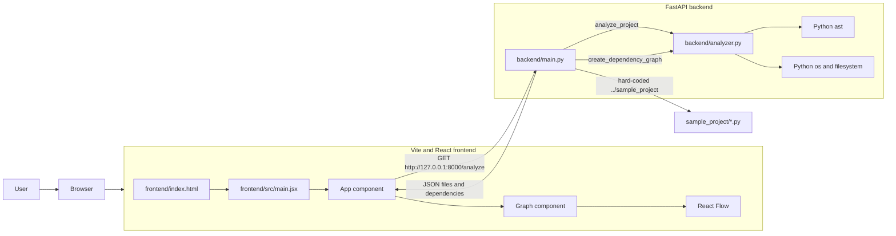
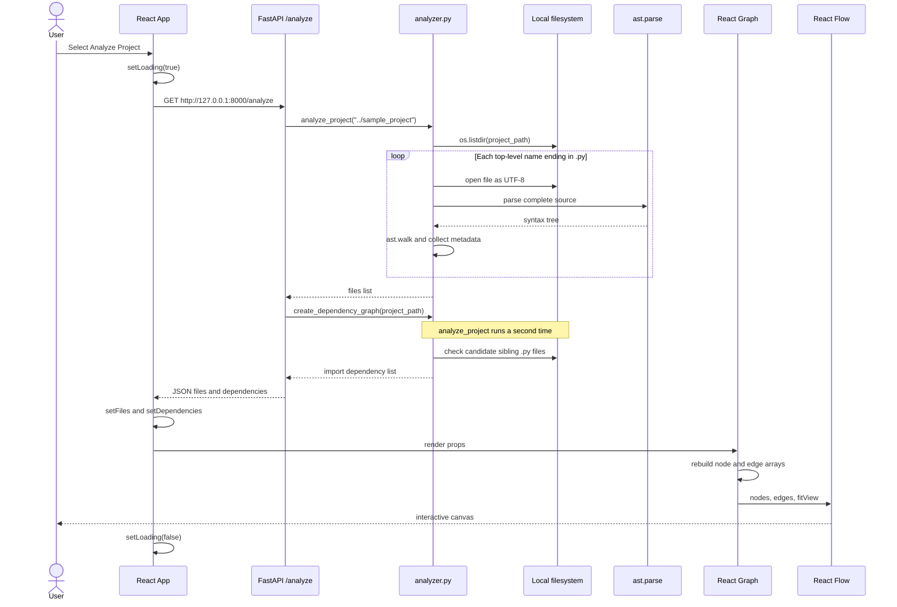
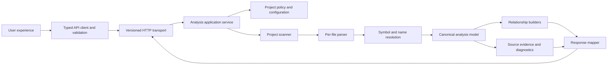

# CodeStruct current architecture

## Purpose and scope

This document records the architecture implemented in the repository during
Phase 3. It is a baseline for later requirements and design work, not a target
architecture or an instruction to implement proposed research features.

The findings marked **Verified** come from source inspection, configuration,
characterization assertions, or direct non-writing execution. **Interpretation**
describes architectural consequences of those facts. **Assumption** identifies a
condition that the repository does not enforce. **Deferred** identifies a design
decision intentionally left for a later phase.

Phase 2 validation remains incomplete. Python syntax checks, direct analyzer and
route-function assertions, frontend ESLint, and an in-memory Vite production
build have passed. The configured pytest suite, Ruff checks, and mypy checks have
not run because those development dependencies are unavailable locally and were
not installed over the network. They are an open prerequisite, not successful
checks.

## Current component architecture



**Verified:** the runtime application has two deployable processes: a Vite
frontend and a Uvicorn/FastAPI backend. The frontend imports no backend code; its
only runtime integration is an HTTP request. The backend analyzes only the
bundled `sample_project` selected inside the route handler.

**Interpretation:** the HTTP boundary separates processes, but there is no stable
application-service or contract boundary inside the backend. Path selection,
orchestration, scanning, parsing, elementary resolution, and response assembly
are coupled through ordinary functions and untyped dictionaries.

## End-to-end request and analysis sequence



### Verified execution details

1. `frontend/index.html` provides `#root` and loads `src/main.jsx` as an ES
   module.
2. `main.jsx` creates a React root, enables `StrictMode`, and mounts `App`.
3. `App` owns three local states: `files`, `dependencies`, and `loading`.
4. Selecting the button calls `analyzeProject`, disables the button through the
   loading state, and issues one hard-coded `fetch` request.
5. `backend/main.py` maps `GET /analyze` to a synchronous function. It assigns
   the literal path `../sample_project`, calls `analyze_project`, then calls
   `create_dependency_graph`.
6. `analyze_project` uses one `os.listdir` call. It accepts only top-level names
   ending exactly in `.py`, opens each as UTF-8, and parses the whole file.
7. `analyze_file` walks every AST node and appends selected syntactic names to
   plain lists. It removes duplicate values while preserving first-observed
   order.
8. `create_dependency_graph` calls `analyze_project` again. For each recorded
   import, it keeps the first dotted segment, appends `.py`, and emits an edge
   only if that file exists in the same directory.
9. FastAPI serializes the returned dictionaries. Neither route declares a
   response model or return type.
10. `App` parses the body as JSON without checking `response.ok`, assigns the two
    expected arrays, and renders `Graph` only when `files.length > 0`.
11. `Graph` creates file nodes and import edges during every render and passes
    them to React Flow with `fitView`, `Background`, and `Controls`.
12. A thrown fetch or JSON error is logged to the browser console and shown as a
    blocking generic alert. The previous graph, if any, is retained.

## Current module relationships

```mermaid
flowchart TD
    FHTML[frontend/index.html] --> FMain[frontend/src/main.jsx]
    FMain --> ReactDOM[react-dom/client]
    FMain --> App[frontend/src/App.jsx]
    App --> React[react]
    App --> Graph[frontend/src/Graph.jsx]
    App -. HTTP at runtime .-> BMain[backend/main.py]
    Graph --> XYFlow[@xyflow/react]

    BMain --> FastAPI[fastapi]
    BMain --> Analyzer[backend/analyzer.py]
    Analyzer --> AST[ast]
    Analyzer --> OS[os]
    Analyzer -. reads .-> Sample[sample_project Python files]

    AnalyzerTests[analyzer characterization tests] --> Analyzer
    APITests[API characterization tests] --> BMain
    APITests --> TestClient[fastapi.testclient]
    CI[GitHub Actions CI] --> PyProject[pyproject.toml]
    CI --> PackageLock[frontend/package-lock.json]
```

The dashed links are runtime or test relationships rather than Python or
JavaScript imports. The production backend contains no Python package boundary:
`backend` has no `__init__.py`, and `main.py` imports `analyzer` as a top-level
module.

## Backend boundaries and coupling

| Concern | Verified implementation | Architectural consequence |
| --- | --- | --- |
| API host | `backend/main.py` creates the FastAPI app, middleware, routes, path, orchestration, and response dictionaries | Transport, configuration, and application logic are one boundary |
| Project selection | `project_path = "../sample_project"` inside `/analyze` | Behavior depends on process working directory and cannot select another project |
| Scanning | `os.listdir` inside `analyze_project` | Only one directory level is represented; ordering follows the filesystem |
| Parsing | File read and `ast.parse` inside `analyze_file` | File I/O and parsing cannot report independent per-file outcomes |
| Extraction | One `ast.walk` loop | Entities from module, class, method, and nested scopes are flattened |
| Resolution | String-to-sibling-file check inside `create_dependency_graph` | This is filename matching, not Python import or symbol resolution |
| Graph construction | List of import-edge dictionaries in `analyzer.py` | No graph domain model, validation, or identity policy exists |
| Configuration | Literals in Python and JSX | Runtime endpoints, origins, and project path are not environment- or file-configurable |
| Packaging | `pyproject.toml` declares `packages = []` and no scripts | Installing project metadata installs dependencies but does not install backend modules or a CLI |

### Working-directory and import behavior

**Verified:** starting Uvicorn from `backend` with `python -m uvicorn main:app
--reload` makes `../sample_project` resolve to the repository's sample directory.
With `backend` added to `PYTHONPATH`, calling `main.analyze()` from the repository
root raises `FileNotFoundError` because the same relative path resolves outside
the application root. Importing `backend.main` from the repository root raises
`ModuleNotFoundError: analyzer` because `from analyzer import ...` expects
`backend` itself on the module search path.

**Interpretation:** the documented startup directory is part of the effective
runtime configuration. Packaging metadata does not remove this requirement.

### Request execution and failure behavior

The `/analyze` handler is synchronous. FastAPI runs ordinary `def` route
functions through its synchronous execution support rather than awaiting the
analysis, but the complete filesystem scan and two AST passes still occupy one
request worker. There is no timeout, cancellation checkpoint, size limit,
progress response, cache, or background-job boundary.

Any `os.listdir`, `open`, UTF-8 decode, or `ast.parse` failure propagates out of
the analyzer. The route has no per-file error collection or custom error mapping,
so one bad file fails the complete request. There is no partial result contract.

### CORS and API contract controls

**Verified:** CORS permits the single origin `http://localhost:5173`, allows
credentials, and permits every method and header. A frontend served from
`http://127.0.0.1:5173`, another port, or a deployed origin is not allowed by this
configuration. CORS does not authenticate non-browser clients.

The API has no version prefix, authentication, authorization, request schema, or
declared response model. Both application routes report `response_model=None`.
The fixed-path endpoint currently accepts no user-controlled filesystem input,
which limits present path-traversal exposure. Exposing future project selection
without a trust-boundary and path policy would materially change that risk.

## Analyzer accuracy baseline

The analyzer reports syntactic observations. Except for checking whether a
sibling filename exists, it does not resolve Python names or prove runtime
relationships.

| Topic | Current behavior and concrete example | Limitation |
| --- | --- | --- |
| Recursive scanning | Reads the three `.py` files directly in `sample_project` | Subdirectories and packages are absent |
| File identity | Uses `os.path.basename`, such as `main.py` | Two nested `main.py` files would collide in data and React Flow IDs |
| Module/package identity | No module name is calculated | `pkg/module.py`, `pkg.__init__`, namespace packages, and relative context are not modeled |
| `import` | `import user` records `"user"` | `import a.b` records `"a.b"`, but dependency matching looks only for sibling `a.py` |
| `from` import | Fixture `from package import thing` records only `"package"` | Imported symbol, alias, relative level, and wildcard semantics are lost; `from . import x` has no module and is ignored |
| Aliases | AST alias names are not read | `import user as u` records `"user"` but does not connect later `u.UserService()` to it |
| Functions | Every `ast.FunctionDef` name is recorded | Methods and nested functions are labeled as functions with no owner or signature |
| Async functions | `ast.AsyncFunctionDef` is not handled | Async functions and methods are absent |
| Classes | Every `ast.ClassDef` name is recorded | Nested scope, decorators, source position, and qualified name are absent |
| Inheritance | `Admin(User)` becomes `{child: Admin, parent: User}`; `Child(package.Base)` keeps only `Base` | Qualification is discarded; subscripts, calls, and other base expressions are ignored |
| Simple calls | `helper()` becomes type `function` with name `helper` | A constructor invoked by bare name is indistinguishable from a function call |
| Attribute calls | `db.get_user()` becomes type `method`, object `db`, function `get_user` | The object is syntax, not a resolved receiver or type |
| Constructor calls | `user.UserService()` becomes a `method` call on object `user` | It is not identified as construction, and `user` is not resolved to the imported module |
| Chained calls | Only attributes whose immediate value is `ast.Name` are accepted | `factory().service.run()` and `pkg.client.run()` are omitted |
| Caller scope | Calls are appended to one file-level list | The caller function, class, nesting, and call-site count are unknown |
| Qualified names | Not constructed | Equal short names in different scopes cannot be distinguished |
| Internal/external | An import becomes internal only when `<first-segment>.py` exists beside the source | Standard-library, third-party, package, missing, and internal imports are not explicitly classified |
| Duplicates | Repeated equal imports, inheritance records, and calls are collapsed | Frequency and multiple call sites are lost; the fixture's two `helper()` calls produce one record |
| Evidence | No path beyond basename and no line/column fields | Results cannot be traced back to source locations |
| Parse failures | Exceptions propagate | Syntax, encoding, permission, deletion races, and partial reads have no structured result |
| Circular imports | Each matching direction can produce an edge | Cycles are not detected or summarized |
| Missing imports | No sibling file means no dependency edge | Missing and external dependencies disappear from the dependency list without explanation |

`create_dependency_graph` removes duplicate edge dictionaries but does not detect
self-loops, cycles, ambiguity, or unresolved candidates. Its output is therefore
an import-file projection, not a general dependency graph or call graph.

## Frontend-backend integration baseline

### Verified behavior

- The API address is the literal `http://127.0.0.1:8000/analyze`; Vite proxying
  and environment configuration are absent.
- The fetch path does not check `response.ok` or validate content type or shape.
- A network or JSON parsing exception produces a console error and generic alert.
- An HTTP error body that is valid JSON may assign `undefined` to `files` and
  `dependencies`; a subsequent `files.length` read can fail during rendering.
- Loading is represented only by disabled button text. There is no visible empty,
  success, stale, or detailed error state.
- A successful empty `files` list renders no graph and no explanation.
- Nodes use `file.file` as their ID. Edges refer to dependency `source` and
  `target`, so all three rely on unique basenames.
- Positions use a fixed three-column grid with 400 horizontal and 350 vertical
  spacing. Node width is fixed at 280, while node height depends on content.
- Node and edge arrays and JSX labels are recreated whenever `Graph` renders.
- Edge IDs use response indexes, so filesystem ordering affects identity.
- The interface has React Flow pan/zoom controls but no project picker, search,
  filtering, relationship toggles, node details, source locations, keyboard
  workflow defined by the application, or explicit large-graph strategy.

### Compatibility interpretation

`Graph` treats every file field as an array and treats calls as a two-variant
shape selected by `call.type === "method"`. Renaming fields, adding nullable
values, changing IDs from basenames, introducing other call variants, or wrapping
the response would require coordinated frontend changes. There is no runtime
schema guard, generated client, contract test shared across languages, or API
version to make that change explicit.

For larger results, rich JSX in every node, animated edges, fixed placement, and
full graph replacement are likely to reduce readability and may increase render
cost. No repository benchmark establishes a failure threshold, so the precise
scale limit is **unknown**, not verified.

## Recommended boundaries for later design

The following diagram records separation candidates only. It does not select
libraries, data models, endpoints, or migration order.



**Architectural interpretation:** these boundaries would isolate policy from
mechanism, allow per-file diagnostics, give identities one owner, and prevent the
UI from depending directly on raw AST extraction dictionaries.

**Deferred:** Phase 3 does not decide whether analysis remains synchronous,
whether results are paged or streamed, which project-selection trust model is
acceptable, how symbols are resolved, whether a graph library is warranted, or
how source navigation should work. Those choices require requirements,
user-experience, scale, and security decisions.

## Prioritized technical debt

Priority meanings used here are: **Critical** for present security, data-loss, or
unsafe-filesystem behavior; **High** for correctness or major architectural
blockers; **Medium** for maintainability, performance, or usability limitations;
and **Low** for cleanup and consistency.

### Critical

No current Critical defect was verified under the fixed sample path, localhost
startup, and read-only AST behavior. Arbitrary project-path input or non-local
exposure must not be added without reassessing path containment, authorization,
resource limits, and sensitive-source disclosure; that would create a Critical
security boundary.

### High

1. Remove working-directory and import-path dependence from the eventual design;
   documented startup is currently the only successful mode.
2. Define stable path/module/symbol identities before recursive or package-aware
   analysis; basenames and short names cannot represent real repositories safely.
3. Define accurate import and call-resolution semantics with explicit unresolved
   results; current edges can be missing or misleading.
4. Define structured per-file diagnostics and partial-failure policy; one unreadable
   or invalid file currently fails the entire request.
5. Establish a validated, versioned response boundary before changing analyzer
   output; the current frontend can fail on HTTP errors or schema drift.
6. Complete the pending Phase 2 pytest, Ruff, and mypy runs before treating the
   baseline or CI workflow as proven.
7. Define the deployment trust boundary before analyzing non-sample source; the
   API has no authentication, authorization, or resource limits.

### Medium

1. Avoid parsing every file twice per request and establish performance budgets.
2. Decide request, job, timeout, cancellation, and caching behavior for large
   projects.
3. Separate configuration, scanning, parsing, resolution, response mapping, and
   API concerns so each can be tested independently.
4. Make frontend endpoint/origin configuration explicit and align it with CORS.
5. Add frontend response validation and useful loading, empty, stale, and error
   states.
6. Define scalable layout, stable edge identity, memoization, accessibility,
   search, filtering, selection, and source-detail behavior.
7. Sort or otherwise specify output ordering when deterministic presentation and
   snapshots matter.

### Low

1. Remove or deliberately adopt unused template assets and `App.css` in a later
   cleanup change.
2. Replace the generic HTML title `frontend` when product naming is addressed.
3. Reconcile the legacy executable `backend/test_analyzer.py` with the pytest test
   organization after the baseline suite is runnable.

## Assumptions and deferred decisions

- **Assumption:** development startup follows the root README and runs Uvicorn
  from `backend`; the code does not enforce this.
- **Assumption:** the analyzed directory contains trusted UTF-8 Python source.
- **Assumption:** the Vite dev server uses `http://localhost:5173` and the backend
  uses `http://127.0.0.1:8000`.
- **Known limitation:** research documents outside the application root describe
  possible dynamic analysis, graph processing, LLM, and IDE capabilities, but
  none are evidence of implemented behavior.
- **Deferred:** project-selection workflow, personas, primary comprehension tasks,
  response versioning, identity semantics, failure UX, evidence display, and
  large-project thresholds belong to later requirements and user-experience work.

The exact current wire shape is documented in
[current-data-contract.md](current-data-contract.md).
