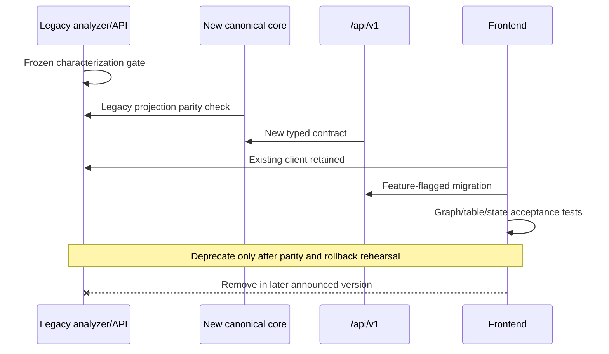

# CodeStruct migration plan

## Purpose

This plan moves the characterized prototype to the target architecture without
implementing any Phase 5 design here. It preserves the current `GET /analyze`
contract until explicit exit criteria are met. Requirements and acceptance IDs
remain stable across steps.

## Migration principles

- Add seams before moving behavior; freeze existing output with characterization
  fixtures and run the pending pytest, Ruff, and mypy checks before relying on them.
- Each stage is independently reviewable, feature-flagged where behavior changes,
  and has a rollback that does not require deleting user source or cache manually.
- Domain records are canonical once introduced; legacy dictionaries, NetworkX,
  Pydantic DTOs, and React Flow elements are projections only.
- Security authorization precedes any new arbitrary project selection.
- A new API runs beside the old route. The old frontend moves only after contract
  and end-to-end parity tests pass.

## Staged migration

```mermaid
flowchart LR
    S0[0 Baseline gate] --> S1[1 Package shell and ports]
    S1 --> S2[2 Parser and metadata]
    S2 --> S3[3 Symbol resolution and graph]
    S3 --> S4[4 Policy jobs and persistence]
    S4 --> S5[5 Versioned API beside legacy]
    S5 --> S6[6 Frontend client and explorer]
    S6 --> S7[7 Verify deprecate and release]
    S7 --> S8[8 Remove legacy in later version]
```

| Stage | Change and verification gate | Compatibility behavior | Rollback point |
| --- | --- | --- | --- |
| 0. Baseline gate | Run existing characterization, pytest/coverage, Ruff, mypy, frontend lint/build; freeze representative legacy JSON | No behavior change | Stop; repository stays at documented prototype |
| 1. Package shell and ports | Add `src/codestruct`, console entry, domain/application protocols, import-boundary tests; startup from root and unrelated CWD | Existing modules/routes remain authoritative | Remove new unused package wiring; keep legacy startup |
| 2. Parser and metadata (Phase 6) | Put current extraction behind `ParserAdapter`; add scoped AST records, locations, aliases, async/nested entities and per-file diagnostics with golden fixtures | Legacy analyzer still emits frozen shape through a mapper or old path | Select legacy parser adapter feature flag; new records have no persistent migration obligation |
| 3. Resolution and graph | Add symbol index, conservative resolver, immutable graph, stable IDs/order, NetworkX adapter and schema invariants | Legacy mapper derives characterized files/dependencies; compare old/new sample output | Disable new resolver/graph flag; retain parser observations |
| 4. Policy, jobs, persistence | Add configured roots, path guard, scanner limits, spawned workers, SQLite repositories, cancellation/cache; pass security/fault/restart tests | Old fixed sample route may invoke coordinator but accepts no new path input | Route legacy endpoint back to direct analyzer; ignore/quarantine new DB version, preserving source |
| 5. Versioned API | Add `/api/v1` Pydantic DTOs, OpenAPI/JSON fixtures, pagination, diagnostics, errors, exact dev CORS | `GET /analyze` remains and is contract-tested; shared use case, separate mapper | Disable v1 route registration; legacy remains deployable |
| 6. Frontend migration | Add dedicated client, reducer states, graph adapter, React Flow renderer, table/search/filter/details/diagnostics, worker layout | Compatibility client can select legacy endpoint; no schema guessing | Switch frontend feature flag/build to legacy client and old Graph |
| 7. Verification and deprecation | Run all 32 acceptance paths, 10 journeys, 13 states, OS/security/a11y/performance suites; publish deprecation condition | Announce legacy but continue serving it; collect local opt-in compatibility events without source/path data | Withdraw deprecation notice in next patch; retain route |
| 8. Later removal | Only after exit criteria, remove old frontend adapter and route in an announced SemVer boundary | Unsupported legacy callers receive explicit unsupported-version guidance in the prior release | Re-release prior compatible version or restore mapper/route from focused revert |

## Legacy compatibility decision

The MVP introduces `/api/v1` alongside `GET /analyze`. The legacy endpoint keeps
the exact top-level `files` and `dependencies` arrays and characterized nested
types/meanings in [current-data-contract.md](current-data-contract.md). It may be
implemented as a projection from the new canonical result only when fixture tests
prove parity; otherwise it continues using the legacy analyzer during migration.
It does not accept an unrestricted project path.

Legacy removal requires all of:

1. Production frontend and documented clients use `/api/v1` exclusively.
2. Frozen legacy and new contract suites, all Must acceptance criteria, and
   rollback rehearsal pass with Phase 2 tooling genuinely available.
3. At least one announced deprecation release and an approved support interval.
4. No supported consumer depends on legacy, established through maintainer review
   and privacy-preserving local opt-in evidence if available.
5. A focused revert can restore the route without downgrading stored canonical
   data or exposing incompatible cache entries.

## Data and cache migration

Each SQLite schema uses an application migration number; each result stores graph
schema, analyzer, parser/runtime, and policy versions. Migrations run transactionally
after a backup/checkpoint, never against project source. Failure leaves the prior
database usable or starts a clean new database while quarantining the corrupt copy.
Old graph-schema cache entries are read only through explicit compatible readers;
otherwise they are misses and evicted by normal retention. No lossy in-place graph
upgrade is required for MVP.

## Deployment compatibility

Development continues with Vite and FastAPI processes. Release packaging adds the
Vite build as Python package data and serves it same-origin from the `codestruct`
entry point. A packaging smoke test verifies the wheel from a clean environment,
from an unrelated working directory, with frontend asset integrity and loopback
binding. The two-process development path remains available and documented.

## Rollback mechanics

- Keep each stage in a focused commit/PR so `git revert` can remove it without
  rewriting shared history.
- Use additive database migrations during compatibility. Never make the old
  binary open a database it cannot understand; versioned runtime directories or
  a read-only compatibility check prevent downgrade corruption.
- Feature flags are trusted local configuration, default to the last verified
  path, and cannot disable security boundaries.
- On job/cache defects, disable cache reuse and perform cold analysis; quarantine
  invalid results rather than deleting source or silently serving them.
- On frontend contract defects, ship the legacy client build while the v1
  API remains available. On v1 backend defects, unregister v1 and retain legacy.
- Security defects that affect path containment or execution stop arbitrary-project
  analysis entirely; fixed sample mode may remain only if independently proven safe.

## Migration sequence interactions

## Ownership and gates

Parser/metadata work owns Phase 6; resolution/graph work follows only after parser
fixtures stabilize. Platform/API/security/persistence work owns the safe project
boundary and cannot expose selection early. Frontend migration begins against
frozen v1 fixtures before live integration. Phase 10 owns numeric limits,
benchmarks, OS matrix, accessibility/user validation, and release readiness.

Unresolved product approvals are the authorized-root administrator, retention and
encryption policy, exact benchmark corpus/thresholds, supported OS/browser/AT
matrix, confidence vocabulary validation, and legacy support interval.
