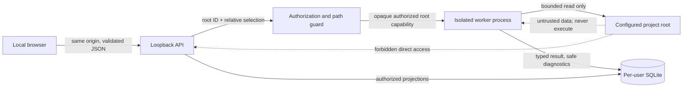

# CodeStruct security model

## Scope and trust boundaries

This is the target MVP security design, not current implementation. The current
prototype remains unauthenticated and safe only for its fixed sample on a trusted
local host. The MVP is a single-user, loopback-only application analyzing local
source under explicitly configured roots. Remote and multi-user deployments are
outside this threat model.

Assets are source confidentiality, filesystem boundaries, host integrity,
analysis correctness/availability, cached result confidentiality/integrity, and
safe diagnostics. An analyzed repository is untrusted data: filenames, source,
encoding, symlinks, junctions, ignore files, and syntax can all be hostile.

## Threats and controls

| Threat | Preventive control | Detection/recovery |
| --- | --- | --- |
| Path traversal or absolute-path injection | clients submit configured `root_id` plus relative path; reject absolute, drive/UNC substitution, `..`, NUL, invalid normalization | stable rejection code; no child reads; security fixtures on each OS |
| Symlink/junction/reparse escape | default deny traversal of every link/reparse entry; resolve selected root and selection with platform-safe canonical APIs; verify containment before and after opening where possible | `PATH_LINK_REJECTED`; skip entry; link-cycle and race tests |
| Case/alias/hard-link confusion | platform-aware canonical comparison, root identity metadata, open-time file metadata checks | changed identity yields diagnostic and skipped unit |
| Source execution | parse bytes with `ast.parse`; no importlib, eval/exec, subprocess, build hooks, project plugins, decorators, annotation evaluation, or shell | side-effect canaries and worker syscall/process observation in security suite |
| Resource exhaustion | file-count, per-file bytes, traversal depth, aggregate bytes, elapsed time, worker memory, graph size, queue, concurrency, API response/query caps | progress/limit diagnostics; cooperative stop then worker termination; partial only when valid data committed |
| Secret disclosure | mandatory secret filename/pattern exclusions before content read; no source or absolute paths in logs/errors/IDs; excerpts off by default | redaction tests and credential-pattern fixtures; quarantine unsafe result |
| Malformed source/encoding/permissions | bounded binary read, BOM/declared encoding policy, structured per-file errors | retain valid units; partial result; safe recovery diagnostic |
| Cache disclosure/tampering | per-user OS data directory permissions, authorization recheck before lookup, SQLite constraints/transactions, schema and checksum validation | quarantine corrupted rows/database copy; cold reanalysis; never fall back to unvalidated data |
| API abuse/CSRF/CORS | loopback bind, same-origin production, exact dev origins, strict methods/headers/body schemas; no credentialed wildcard CORS | request IDs, local rate/concurrency limits, safe 4xx/429 |
| Stale/confused-deputy job | ownership context plus root/policy fingerprint on every job/result access; opaque IDs are not authorization | reject changed/revoked root; expire result; audit-safe event |
| Parser/resolver correctness confusion | evidence origin and resolution status are distinct; reserved inference origins prohibited | schema invariants and deterministic fixtures |
| Dependency/supply-chain compromise | locked frontend dependencies, bounded Python versions, CI review; release dependency scanning deferred to maintainer policy | SBOM/signing decision before distribution; rollback by version |

## Authorized-root policy

Authorized roots are named entries in trusted application configuration, loaded
at startup from a per-user/admin-controlled TOML file. Requests select a root by
opaque non-secret ID and a relative descendant. Request data cannot create roots.

Validation order is mandatory:

1. Validate JSON types/lengths and root ID without filesystem access.
2. Reject absolute paths, drive-qualified paths, UNC paths, NULs, empty invalid
   segments, parent traversal, and unsupported normalization.
3. Resolve the configured root and selected directory through the platform
   filesystem API; require an existing directory.
4. Compare canonical identities with platform-aware containment, never string
   prefixing. On Windows account for drive/UNC identity, case-insensitive aliases,
   junctions, mount points, and reparse tags.
5. Reject any selected path containing a symlink, junction, mount escape, or other
   reparse point. MVP also does not traverse in-root links; reconsideration needs
   a dedicated ADR and tests.
6. Create an opaque `ProjectRoot` capability carrying canonical identity privately
   and a safe display label publicly. Only scanner/worker ports accept it.
7. Revalidate identity in the spawned worker immediately before enumeration and
   check each entry at open time to reduce check/use races.

No cache metadata is queried or disclosed for a selection until authorization
succeeds. Revoking/changing a root makes associated cached results inaccessible
even if not yet evicted.

## Scanner and content policy

Mandatory exclusions cannot be overridden: VCS internals; `.env` and variants;
private keys, credential files, secret-manager output and configured sensitive
patterns; virtual environments; Python/tool caches; dependency/vendor trees;
build/generated artifacts; CodeStruct runtime/cache output; device files; sockets;
and every link/reparse point. Project ignore rules may only add exclusions.

The scanner uses deterministic, non-following enumeration and accepts regular
`.py` files for MVP. `.pyi`, notebooks, bytecode, archives, native extensions,
and generated parser inputs are excluded or diagnosed as unsupported. Files are
opened read-only, bounded before allocation, and metadata is rechecked after open.
Python encoding cookies and BOMs are handled using the standard tokenizer rules;
unknown/invalid encoding, short read, permission loss, deletion race, and decode
failure become per-file diagnostics.

Policy contains configured maxima for included entries, scanned entries,
traversal depth, bytes per file, total bytes, elapsed time, worker resident memory,
nodes, edges, evidence, diagnostics, cache bytes, concurrent jobs, queued jobs,
request bytes, response bytes, query time, cursor page, and frontend render slice.
Numeric defaults require Phase 10 benchmark/threat evidence. Security maxima are
hard caps; users may request smaller scopes only.

## Process and cancellation isolation

The loopback API never analyzes in its event loop. Each active attempt uses a
fresh spawned process with a sanitized working directory/environment and only the
authorized capability, effective policy, and IPC endpoints it needs. Workers do
not inherit network credentials intentionally. Platform sandboxing beyond process
separation is desirable but deferred until deployment targets are selected.

The worker reports monotonic progress and checks cancellation between bounded
scanner batches, files, resolution passes, graph commit preparation, and metric
algorithms. Timeout/memory breach sets cancellation, then terminates the worker
after a grace interval. The coordinator persists one safe terminal outcome and
cleans temporary rows transactionally.

## API and browser controls

- Bind to `127.0.0.1`/`::1` only and use a random available port or configured
  loopback port. Refuse non-loopback binding in the MVP profile.
- Serve production frontend assets highlights same-origin; production CORS is
  disabled. Development CORS lists exact Vite origins, necessary methods/headers,
  and does not allow credentials by default.
- Strict Pydantic schemas reject unknown fields, oversize strings/lists,
  unsupported enum values, and unsafe option combinations before coordination.
- Apply per-process/local-principal submission, concurrent-job, queue, polling,
  and expensive-query limits. Return `429` and bounded `Retry-After` without
  revealing another job.
- Treat unguessable IDs and signed cursors as integrity/privacy aids, not access
  control. Bind every access to the local ownership context and current root policy.
- Render source excerpts as inert text; never inject HTML. Use a restrictive CSP
  for packaged assets, deny framing, set `nosniff`, and avoid remote assets.

## Diagnostics, logs, and observability

Public diagnostics contain stable code, phase, severity, safe project-relative
location when authorized, consequence, recovery, and bounded structured context.
They never contain canonical absolute paths, root targets, usernames, source
content by default, environment/config values, SQL, raw exceptions, or stack
traces. Unknown exceptions map to `INTERNAL_ERROR` plus request ID.

Structured local logs use the standard logging package and an allowlist of event
fields: timestamp, severity, event code, request/job/result IDs, phase, durations,
counts, limit name, terminal state, and redacted exception category. A central
redaction formatter hashes or removes path/source/request values before any sink.
Log rotation, retention, and permissions align with per-user runtime policy.
Debug logging never disables redaction. Tests inject canary secrets and paths.

## Cache and persistence security

SQLite resides in the platform per-user application-data directory, not the
analyzed project. Restrictive user permissions are set where the OS supports them.
Encryption at rest is not claimed; users needing protection rely on OS account and
disk encryption. A multi-user host or regulated-data deployment triggers
reconsideration and likely encrypted/user-separated storage.

Project fingerprints use keyed or domain-separated hashes and are never reversible
path indexes. Cache keys include analyzer, exact parser runtime, source grammar,
graph schema, and effective policy versions. Results are exposed only after fresh
authorization. Checksums, foreign keys, transactions, and schema validation guard
integrity. Corruption is quarantined and treated as a miss; source is reanalyzed
only on explicit/normal workflow, never executed.

## Security invariants and verification

1. Rejected projects cause zero child enumeration/read.
2. Analyzed code is never executed or imported.
3. Only canonical authorized regular files passing exclusions and limits are read.
4. Public IDs/messages/logs do not disclose protected absolute paths or secrets.
5. Every accepted job reaches exactly one terminal outcome.
6. No cache result bypasses current authorization, schema, policy, and integrity.
7. Domain/API contracts cannot emit reserved runtime/type/LLM evidence in MVP.

Verification includes unit property tests for normalization/containment, Windows
junction and POSIX link integration fixtures, traversal fuzzing, side-effect
canaries, file-race/permission/encoding fixtures, limit and worker-failure
injection, API schema/rate/CORS/header tests, cache corruption/authorization tests,
and log/diagnostic secret scans. Exact OS/assistive/browser and benchmark matrices
remain unresolved until Phase 10.

## Reconsideration triggers

Non-loopback binding, multiple OS users, remote repositories/uploads, following
links, source excerpts enabled by default, project plugins, dynamic tracing,
LLM/type providers, encrypted-cache requirements, or elevated worker privileges
requires a fresh threat model and ADR before implementation.

