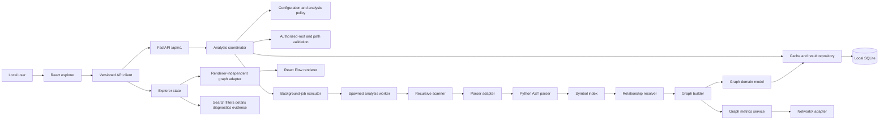
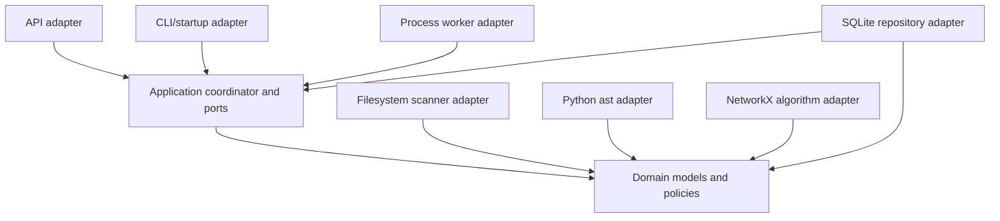
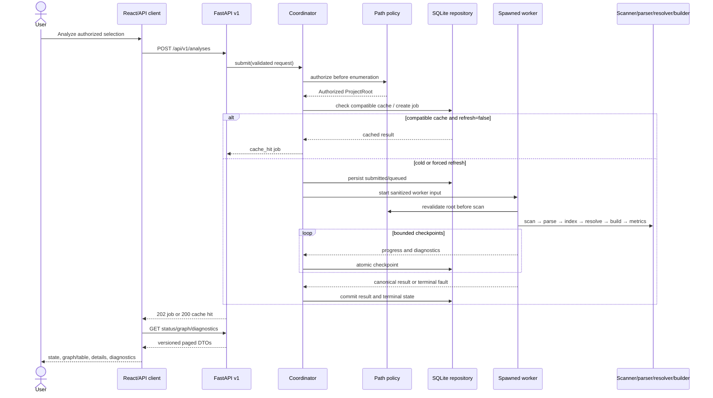
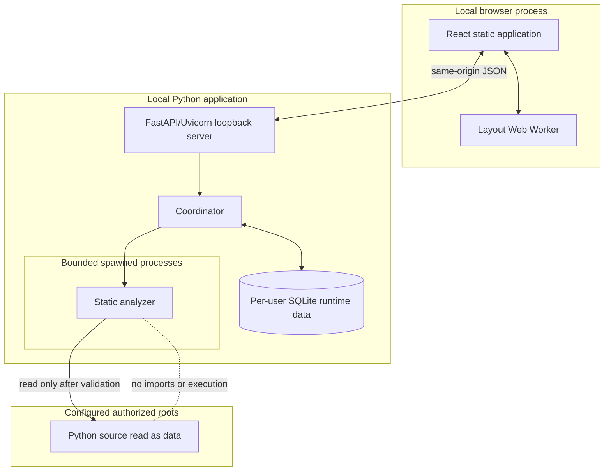

# CodeStruct target architecture

## Status and scope

This Phase 5 document defines the target MVP architecture. It is a design, not
implemented behavior. Verified prototype behavior remains documented in
[current-architecture.md](current-architecture.md); the approved requirements are
in [product-requirements.md](../product-requirements.md). Phase 2 pytest, Ruff,
and mypy execution remains a release prerequisite and is not considered passed.

Decisions here optimize for a local, deterministic Python analyzer. Dynamic
tracing, LLM/RAG analysis, graph databases, advanced points-to analysis,
architecture clustering, design-pattern detection, Cytoscape migration, and
Thonny integration remain outside MVP.

## Architectural drivers

1. Validate authorization before reading any selected project child.
2. Never import or execute analyzed source.
3. Preserve syntax evidence separately from resolution claims.
4. Give files, symbols, relationships, jobs, and results stable typed identities.
5. Keep the domain independent of FastAPI, Pydantic transport DTOs, NetworkX,
   React, and React Flow.
6. Bound filesystem, CPU, memory, persistence, API, and rendering work.
7. Keep deterministic ordering and partial failure visible end to end.
8. Migrate beside the characterized endpoint before removing it.

## Target component architecture



## Backend dependency direction

Arrows mean “may depend on.” Ports are defined toward the domain; adapters
implement them outward.



Rules:

- API handlers validate DTOs, authorize through application ports, and invoke
  use cases; they never scan, parse, resolve, or build graphs directly.
- Scanning emits ordered source descriptors and diagnostics, never UI nodes.
- Parser adapters depend only on parser/domain protocols, never FastAPI,
  NetworkX, React, or React Flow.
- Immutable domain dataclasses are the canonical model. NetworkX is a transient
  algorithm projection; Pydantic models are transport projections.
- The frontend accesses `/api/v1` only through its API client. Renderers consume
  renderer-neutral view models from the graph adapter.
- Static evidence origins are sealed for MVP. Future dynamic, type-inferred, or
  LLM evidence enters through separate providers and cannot upgrade or rewrite
  deterministic static evidence.
- Imports follow layers: `api/adapters -> application -> domain`; infrastructure
  implements application/domain ports. Cross-feature imports use public ports,
  not concrete adapters. Dependency-cycle tests enforce this rule.

## Backend component contracts

“Must not” is part of each boundary, not guidance.

| Component | Responsibility; inputs → outputs | Dependencies and public interface | Errors and concurrency | Test boundary; must not |
| --- | --- | --- | --- | --- |
| Configuration and analysis policy | Load trusted defaults, TOML, and allowlisted environment overrides → immutable `AnalysisPolicy` with roots, exclusions, limits, versions, CORS, retention | stdlib `tomllib`, platform paths; `PolicyProvider.load()`, `policy_fingerprint()` | Fail startup on invalid security policy; immutable and thread/process safe | Precedence, validation, fingerprint tests; must not scan projects, store secrets, or accept request overrides that weaken policy |
| Authorized-root and path-validation service | Selection plus policy → canonical authorized `ProjectRoot` or safe rejection | filesystem metadata abstraction and policy; `authorize(selection)`, `revalidate(root)` | Resolve/canonicalize races defensively; no child enumeration before success | Windows/POSIX containment, traversal, case, link, race fixtures; must not enumerate or parse project files |
| Recursive project scanner | Authorized root plus scan policy → deterministic `SourceUnit` stream, exclusion summary, diagnostics | authorized `ProjectRoot`, filesystem port, cancellation/limit token; `scan()` iterator | Per-entry permission/encoding-neutral discovery diagnostics; bounded single traversal | Nested packages, collisions, ignores, links, depth/count tests; must not parse content, resolve symbols, or build graphs |
| Parser adapter interface | `SourceUnit` bytes/text and parser options → `ParsedUnit` observations/diagnostics | domain types only; `ParserAdapter.parse(unit, options)` | One unit failure returns diagnostic, not global exception; reentrant | Contract suite for every parser; must not read arbitrary paths, import source, resolve cross-file names, or know HTTP/UI |
| Python AST parser | Authorized bounded bytes → scoped definitions, imports, call/base expressions, exact spans | stdlib `ast`, parser protocol; `PythonAstParser.parse()` | CPU-bound, process-local, cooperative checkpoints between files; syntax/encoding errors become diagnostics | Python 3.10–3.14 fixtures and side-effect canaries; must not execute, import, evaluate annotations, or claim cross-file resolution |
| Symbol index | Ordered parsed units → immutable index of project/module/symbol candidates and aliases | domain identities; `SymbolIndex.build()`, `lookup_*()` | Duplicate/ambiguous names retained explicitly; build confined to one worker | package, relative import, alias, nested scope, duplicate-name tests; must not mutate parsed observations or infer runtime types |
| Relationship resolver | Parsed observations plus index → resolved, ambiguous, unresolved, and syntactic relationship candidates | symbol-index and domain ports; `resolve_all()` | Per-observation diagnostics; deterministic bounded passes | imports, inheritance, constructors, direct/attribute/chained calls, cycles/missing targets; must not fabricate certainty or execute code |
| Graph domain model | Canonical immutable nodes, edges, evidence, locations, diagnostics, metadata | Python stdlib dataclasses/enums only; constructors plus invariant validators | Reject invalid IDs/endpoints/ranges at boundary; immutable/shareable | Invariant, equality, serialization-round-trip tests; must not import Pydantic, NetworkX, FastAPI, React, or storage code |
| Graph builder | Parsed units and relationships → canonical graph plus summaries | domain model and identity service; `build_graph()` | Dedupe semantic edges while retaining all evidence; deterministic sort | stable IDs/order, partial and collision fixtures; must not calculate UI coordinates or persist data |
| Graph metrics service | Canonical graph/slice → bounded metric annotations and summaries | `GraphAlgorithmPort`; NetworkX adapter implements it | Skip/degrade with diagnostic when limits exceeded; worker-only | Golden small graphs, limits, cycles; must not make NetworkX objects canonical or mutate graph |
| Analysis coordinator | Create/reuse attempts, enforce lifecycle, connect authorization/jobs/repository → job/result handles | application ports only; `submit`, `status`, `cancel`, `get_result` | Atomic transitions; idempotency/dedup rules; safe concurrent callers | State, retry, duplicate, restart, timeout tests; must not parse or touch project children directly |
| Background-job executor | Run bounded analysis in spawned process, relay progress/checkpoints, enforce hard termination | coordinator port, process launcher, policy | Global/per-root concurrency bounds; one worker process per active job; abnormal exit → failed/partial | cancel/timeout/crash/memory tests; must not accept unauthenticated paths or own result schema |
| Cache and result repository | Durable jobs and reusable result snapshots with transactional queries | SQLite adapter, domain serializers; `JobRepository`, `ResultRepository` ports | WAL, transactions, corruption quarantine; serialized writes, concurrent reads | restart, migration, authorization, eviction, corruption tests; must not decide path authorization or expose storage paths |
| Versioned API layer | Map HTTP/Pydantic DTOs to use cases and stable envelopes | FastAPI, Pydantic, coordinator/query ports | Validation/error mapping; async handlers; no blocking analysis | OpenAPI, contract, auth/path and error tests; must not import parser/scanner/NetworkX implementations |

## Frontend component contracts

| Component | Responsibility; inputs → outputs | Dependencies and public interface | Errors and concurrency | Test boundary; must not |
| --- | --- | --- | --- | --- |
| Frontend API client | Typed `/api/v1` calls and runtime response validation → domain-neutral DTOs | `fetch`, generated or checked schema types; `createAnalysis`, `getAnalysis`, `getGraph`, `getDiagnostics`, `cancelAnalysis` | AbortController, timeout/retry policy, malformed/HTTP error union | Contract fixtures and mocked transport; must not own UI state or call legacy route except compatibility adapter |
| Explorer state management | UI/job state machine, selections, query/filter/slice state → view state/actions | React `useReducer` plus scoped contexts and API client | Ignore stale request tokens; polling backoff; cancellation is explicit | Reducer transition tests for all 13 UX states; must not create React Flow elements or parse response ad hoc |
| Renderer-independent graph adapter | Contract graph slice plus presentation settings → generic visual nodes/edges/table rows | pure frontend model; `adaptGraphSlice()` | Pure/memoizable; deterministic; enforces render cap | fixture, collision, filter, ordering tests; must not fetch, lay out on main thread, or expose React Flow types upstream |
| React Flow renderer | Render generic view model, interactions, accessible controls | `@xyflow/react`; renderer props/events | Memoized; viewport operations only; reduced motion | component/a11y/input tests; must not interpret backend semantics or become sole graph representation |
| Search view | Query names/IDs and navigate matches | explorer selectors/actions | Debounced locally; stale result guarded by graph ID | repeated-name and keyboard tests; must not mutate analysis result |
| Filters view | Select entity/relationship/resolution/confidence facets | explorer selectors/actions | Pure presentation filtering within loaded slice; server query for wider scope | graph/table parity tests; must not imply hidden means absent |
| Details view | Present entity/edge identity, connections, metadata | selected canonical DTO | Missing fields shown explicitly; no unsafe HTML | entity/edge fixtures; must not infer relationships |
| Diagnostics view | Paginated severity/phase/code/location and recovery actions | diagnostics API and state | Incremental loading; errors remain separate from analysis outcome | partial/failure/a11y tests; must not show stack traces or canonical protected paths |
| Source-evidence view | Bounded project-relative locations/excerpts and origin/confidence | evidence DTO and policy flags | Lazy fetch if excerpts enabled; cancellation on selection change | redaction, range, unavailable tests; must not read local paths directly or execute/render active content |

## Analysis sequence



## Runtime and deployment boundaries



Production binds to loopback and serves the packaged frontend same-origin. Vite
runs separately only in development with an explicit origin allowlist. Remote or
multi-user deployment requires a new authentication, isolation, and storage
threat model and is not an MVP configuration.

## Requirement traceability

Implementation phase labels are planning targets: Phase 6 parsing/metadata,
Phase 7 resolution/graph, Phase 8 platform/API/security/persistence, Phase 9
explorer UX, and Phase 10 verification/performance. They do not begin those phases.

| Must requirement | Responsible target component | Contract element | Security/performance control | Future phase |
| --- | --- | --- | --- | --- |
| `FR-SCAN-001` | Path-validation service | `CreateAnalysisRequest.project` / `PROJECT_UNAUTHORIZED` | canonical containment before enumeration | 8 |
| `FR-SCAN-002` | Recursive scanner | file/module nodes with stable relative IDs | depth/count limits, sorted traversal | 6 |
| `FR-SCAN-003` | Policy + scanner | exclusion summary and diagnostics | non-overridable sensitive defaults | 6, 8 |
| `FR-ANALYZE-001` | AST parser + symbol index | node kinds, containment, qualified names | bounded file parse, no execution | 6 |
| `FR-ANALYZE-002` | Relationship resolver | typed edges and `resolution_status` | conservative resolution, no fabricated targets | 7 |
| `FR-ANALYZE-003` | Parser/resolver/graph model | evidence, origin, confidence, locations | project-relative redacted evidence | 6, 7 |
| `FR-JOB-001` | Coordinator + executor | job resource, phase/progress | durable atomic state, bounded polling | 8 |
| `FR-JOB-002` | Coordinator + executor | DELETE cancellation and terminal status | checkpoints plus hard timeout/worker termination | 8 |
| `FR-ERROR-001` | Parser + coordinator | `partial` outcome and retained graph | per-file fault isolation | 6, 8 |
| `FR-ERROR-002` | Diagnostics + API/view | diagnostic collection/error envelope | stable safe codes, log/path redaction | 6, 8, 9 |
| `FR-GRAPH-001` | Graph adapter + React Flow | graph slice and selection IDs | render cap, reduced motion, keyboard controls | 9 |
| `FR-SEARCH-001` | Search view + result repository | graph query `q`, node IDs/qnames | indexed bounded queries | 8, 9 |
| `FR-FILTER-001` | Filters + repository | kind/status/confidence parameters | bounded pages, visible/total counts | 8, 9 |
| `FR-DETAIL-001` | Details/evidence views | node/edge/evidence records | safe relative paths, bounded excerpts | 9 |
| `FR-STATE-001` | Explorer state + coordinator | job states and typed errors | monotonic attempt tokens, atomic transitions | 8, 9 |
| `FR-SCALE-001` | Metrics + repository + graph adapter | summaries, slices, aggregation metadata | API/render limits, progressive expansion | 7–10 |
| `FR-REFRESH-001` | Coordinator + result repository | cache metadata, `refresh`, new attempt ID | reauthorization, fingerprints, retention | 8, 9 |
| `FR-COMPAT-001` | API compatibility adapter | legacy `GET /analyze` plus v1 schema | contract fixtures and explicit deprecation | 8, 9 |
| `NFR-SEC-001` | Policy + path validator | safe policy error | canonical configured-root containment | 8 |
| `NFR-SEC-002` | Path validator + scanner | `PATH_LINK_REJECTED` diagnostic | default-deny symlink/junction/reparse traversal | 8 |
| `NFR-SEC-003` | Parser interface + worker | static `evidence_origin` | no imports/eval/subprocess/project hooks | 6, 10 |
| `NFR-SEC-004` | Policy + scanner + executor | limit metadata/diagnostics | file/bytes/depth/time/memory/concurrency caps | 8, 10 |
| `NFR-PRIV-001` | API deployment + repository | local-only cache metadata | loopback/same-origin, per-user data permissions | 8, 10 |
| `NFR-PERF-001` | Coordinator + metrics | phase timing and summary | benchmark hooks, bounded algorithms | 10 |
| `NFR-RESP-001` | Executor + explorer state/layout | progress, cursors, slices | background work, Web Worker layout, render caps | 8–10 |
| `NFR-REL-001` | Coordinator + repository | exclusive terminal state and partial flag | transactions, crash reconciliation | 8, 10 |
| `NFR-A11Y-001` | Renderer + table/views | semantic text equivalent | WCAG test matrix, reduced motion | 9, 10 |
| `NFR-PLAT-001` | Packaging + filesystem adapters | platform-neutral POSIX relative paths | Windows junction and POSIX symlink tests | 8, 10 |
| `NFR-DETER-001` | Scanner/index/builder | stable IDs, order, fingerprints | sorted inputs and canonical serialization | 6–10 |
| `NFR-TEST-001` | Every component | schemas, ports, fixtures | unit/contract/integration/security/a11y gates | 6–10 |
| `NFR-BACK-001` | API compatibility adapter | frozen legacy envelope | deprecation telemetry and regression fixtures | 8–10 |
| `NFR-PACK-001` | Python package/startup adapter | `codestruct` console entry | src layout, platform data dirs, CWD independence | 8 |

## Technology selection summary

| Area | MVP decision | Key reason / boundary |
| --- | --- | --- |
| Python | CPython 3.10–3.14; setuptools `src` package | honors current metadata; exact runtime enters fingerprints |
| API | FastAPI with Pydantic request/response DTOs | OpenAPI and validation; DTOs stay outside domain |
| Parser | standard-library `ast` | deterministic supported metadata without native parser dependency |
| Domain | frozen slotted dataclasses and enums | framework-neutral canonical model |
| Algorithms | NetworkX adapter | mature bounded metrics; never stored as schema |
| Visualization | React Flow retained | installed and adequate behind an adapter |
| Jobs | async HTTP coordination plus bounded spawned worker processes | responsive API, cooperative cancel, hard isolation |
| State/cache | per-user SQLite in WAL mode | transactional jobs, queryable graph slices, restart visibility |
| JSON/versioning | Pydantic JSON, explicit `schema_version`, additive evolution | typed contract and controlled compatibility |
| Frontend state | React `useReducer` + scoped contexts | sufficient for one local explorer without another store |
| Layout | `@dagrejs/dagre` layered adapter in a Web Worker | deterministic bounded layout off the main thread; replaceable |
| Observability | stdlib structured JSON logging with redaction | no required logging dependency |
| Configuration | immutable dataclass from defaults, trusted TOML, allowlisted env | explicit precedence and fingerprinting |
| Tests | pytest/pytest-cov/Ruff/mypy; Vitest/React Testing Library/axe-core; Playwright; ESLint/Vite | unit, contract, security, accessibility, journey, and build coverage |
| Distribution | Vite assets packaged into the Python wheel for same-origin production | single local install; Vite remains separate in development |

Detailed trade-offs are recorded in [the ADR index](../decisions/README.md).

## Performance architecture

- Progress is persisted at bounded phase/item checkpoints and fetched with
  conditional polling for MVP; SSE is a compatible later enhancement.
- Worker-process count, jobs per root, parser work, SQLite writers, page sizes,
  evidence excerpts, metric algorithms, and renderer elements are bounded.
- Scanner paths, parsed units, symbols, edges, evidence, and diagnostics are
  processed and serialized in canonical order. Builders consume iterators and
  commit batches rather than retaining duplicate AST/source representations.
- Repository queries provide cursor pages and bounded neighborhood slices.
  Large graphs start at package/directory summaries and expand progressively.
- Layout runs away from the browser main thread. React Flow never receives more
  elements than presentation policy permits; the table remains complete via pages.
- Phase 10 establishes cold/warm median and p95 phase durations, peak worker and
  browser memory, database/result size, cache hit latency, cancel acknowledgement,
  search/filter/detail latency, layout time, and maximum usable rendered slice.

## Repository and package layout

```text
src/codestruct/
  domain/                 # dataclasses, enums, IDs, invariants
  application/            # coordinator, ports, state machine
  analysis/               # scanner, parser protocol/AST adapter, index, resolver
  graph/                  # builder and algorithm port/adapters
  infrastructure/         # SQLite, filesystem, process executor, configuration
  api/v1/                 # FastAPI routes and Pydantic DTOs/mappers
  api/legacy/             # temporary characterized /analyze adapter
  web/                    # packaged Vite assets
  cli.py                  # installed CWD-independent entry point
tests/
  unit/ contract/ integration/ security/ fixtures/
frontend/src/
  api/ explorer/ graph/ search/ filters/ details/ diagnostics/ evidence/ layout/
schemas/                  # checked JSON Schema snapshots; generated client if justified
```

Runtime data uses the OS per-user application-data directory, never the source
tree: one SQLite database plus lock/quarantine files. A future Thonny integration
may implement the versioned client/application port in a separate adapter package;
it must not import parser internals. Migration details are in
[migration-plan.md](migration-plan.md).

## Assumptions and unresolved choices

- Numeric limits, benchmark corpus, supported browser/assistive-technology
  matrix, cache retention duration/size, and legacy endpoint removal date require
  Phase 10 evidence or product-owner approval.
- In-root symlinks and junctions are rejected for MVP. Reconsidering requires
  platform-specific containment and cycle evidence.
- Python 3.10–3.14 application runtimes remain supported; a configured source
  grammar newer than the running interpreter is rejected with a diagnostic.
- “Practical call” resolution is conservative lexical/import resolution only;
  type inference and advanced points-to behavior are explicitly deferred.
- Source excerpts are disabled by default until product privacy policy approves
  bounded excerpt persistence; locations and AST evidence remain available.
