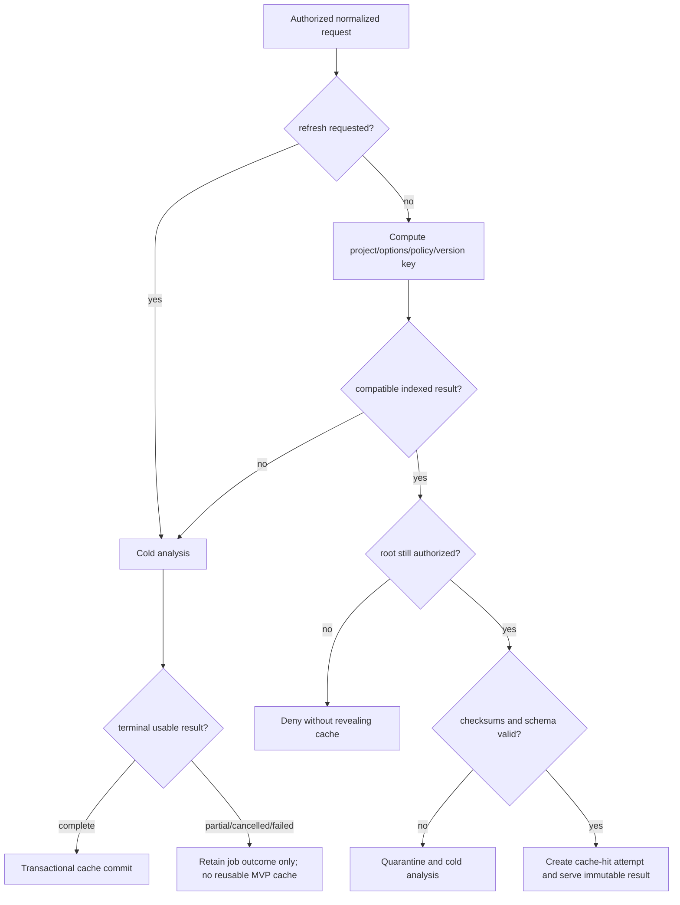

# ADR-005: Cache and persistence strategy

- **Status:** Accepted for MVP target
- **Date:** 2026-09-12

## Context

Jobs need restart-visible states and atomic terminal outcomes. Reusable results
need filtered graph slices, diagnostics pagination, integrity checks, retention,
and authorization without a server or graph database.

## Decision

Use one per-user SQLite database in the platform application-data directory, WAL
mode, foreign keys, explicit migrations, and transactional repositories. Separate
temporary job/progress tables from immutable reusable result, node, edge,
evidence, diagnostic, summary, fingerprint, and idempotency tables. Store no
absolute public paths and no source excerpts by default.

Cache keys include project/file fingerprints, analyzer/runtime/parser versions,
graph schema, normalized analysis options, and effective policy version/digest.
Fingerprint regular included files from safe relative path, size, stable metadata,
and content hash; metadata can avoid rehashing only when identity/size/time remain
credible. Forced refresh bypasses reuse. Partial file reuse is deferred until
dependency-aware invalidation is proven; MVP may reuse only a complete compatible
result. Corruption quarantines the affected database/result and causes a cold run.
Configured size/age/LRU eviction removes unreferenced results transactionally.

Any included content/path, effective option, analyzer/parser/runtime version,
graph-schema compatibility, or policy fingerprint change is a cache miss. Root
revocation makes entries inaccessible; project deletion, retention expiry, manual
refresh, integrity failure, and explicit local cache clearing invalidate reuse.

## Alternatives considered

- In-memory jobs/results: smallest code but loses restart state and cache.
- Filesystem JSON cache: transparent but weak atomic querying/pagination and
  concurrency.
- SQLite metadata plus JSON blobs: simpler writes but poor filtered slices and
  large-result memory use.
- Graph database: disproportionate and outside MVP.

## Reasons

SQLite is bundled with Python, transactional, local, queryable, portable, and
adequate for one-user bounded concurrency. One repository abstraction preserves a
future storage seam.

## Consequences and risks

Schema migrations and query/index design require care; WAL files and permissions
are part of privacy controls. SQLite is not multi-host storage. Content hashing is
I/O cost. Exact retention, maximum size, encryption-at-rest need policy approval;
if OS storage permissions are inadequate, caching must be disabled rather than
silently weakened.

## Cache decision flow

## Reconsider when

Multi-user/remote operation, cache encryption mandates, benchmarked write/query
limits, or approved partial incremental analysis exceed SQLite. Reconsider partial
reuse after dependency invalidation tests and correctness metrics exist.
